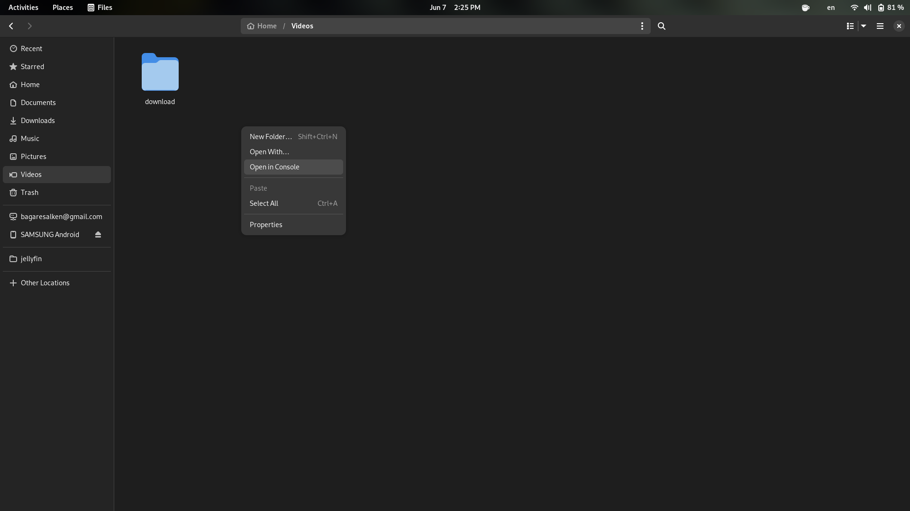

# bilibili-extractor-cli

This is a CLI tool for the library [bilibili-extractor](https://github.com/nanashi-1/bilibili-extractor).

## Installation

### Build

    git clone https://github.com/nanashi-1/bilibili-extractor-cli && cd bilibili-extractor-cli
    cargo install --path .

## Usage

1. Locate the Bilibili download directory. (location: "`Internal Storage/Android/data/com.bstar.intl/download`")

2. Copy the Bilibili download directory to a safe place

3. Launch terminal in that directory

4. Run this command

> Note: `-d` here forces the program to move the output instead of copying it resulting in faster packaging. You can also specify `-H` or `--hard-sub` to merge subtitle into the video as a hard sub.

## Lisence

This project is licensed under the MIT License.
